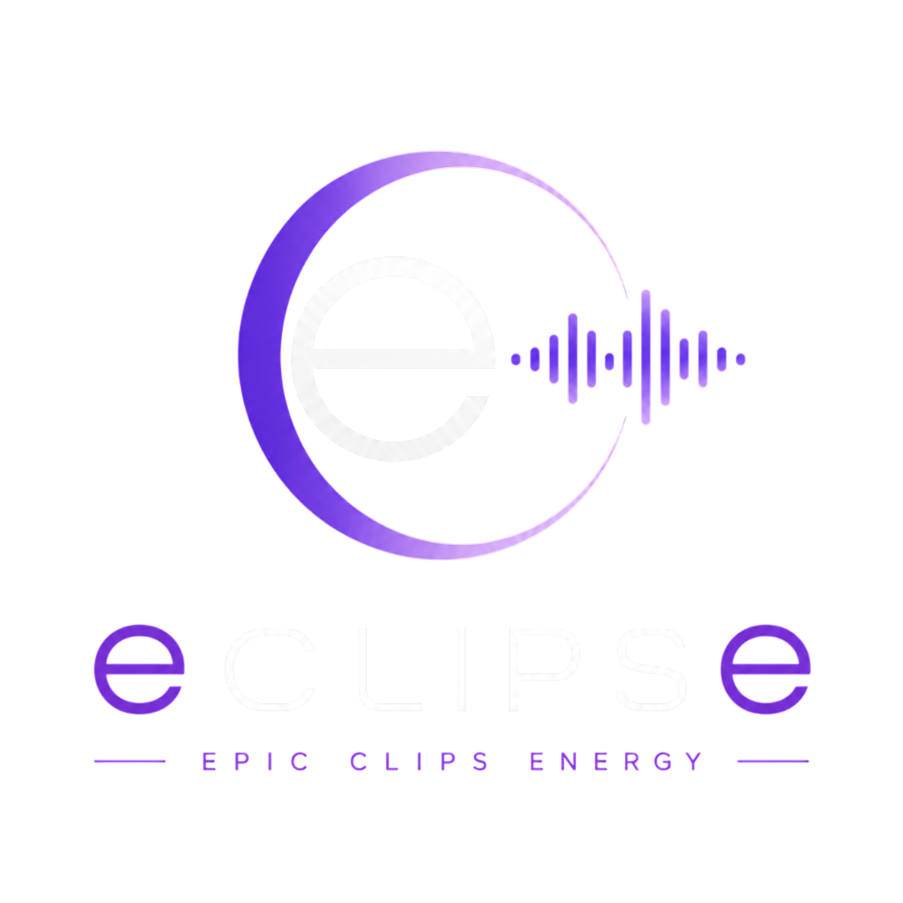

<div align="center">
  
  <h1 style="font-size: 3rem; margin-top: 20px;">eCLIPSe</h1>
  <p><em>Redefining the modern music streaming experience with offline resilience and precision clipping.</em></p>
  <p>
    
    
    
    
    
  </p>
</div>

<br />

## 📖 Executive Overview

**eCLIPSe** is a highly interactive, full-stack music streaming platform engineered to bridge the gap between passive listening and active audio curation. In an era where network reliability can fluctuate, eCLIPSe guarantees an uninterrupted auditory journey by seamlessly transitioning between online streaming and local offline playback. 

Beyond standard streaming capabilities, eCLIPSe empowers users to extract and save specific segments—or **clips**—from their favorite tracks. These clips can be assembled into highly personalized, curated playlists, allowing users to focus only on the drops, choruses, or instrumental solos they love the most. 

Built with a robust client-server architecture, the application utilizes cutting-edge web technologies such as IndexedDB for large-scale client-side caching of audio blobs, the Web Audio API via Wavesurfer.js for precise waveform visualization, and WebSocket communication to synchronize playback state and user activities in real-time across multiple active sessions. A high-performance Redis cache layer is seamlessly integrated into the backend, heavily reducing database queries and accelerating data retrieval for frequently accessed tracks and playlists.

## ✨ Key Features

*   **🎧 Immersive Music Playback**:
    *   Smooth audio streaming with high-fidelity visualization using Wavesurfer.js waveforms.
    *   **Real-Time Audio Synthesis Engine**: Custom Web Audio API generative engine (`audioSynth.js`) capable of synthesizing Lo-Fi, Synthwave, Techno, and Acoustic tracks completely offline without any network bandwidth.
    *   **Interactive Karaoke Lyrics**: Synchronized, scrolling lyrics that highlight dynamically based on real-time playback position.
    *   Real-time state synchronization across sessions utilizing Socket.io.
*   **💾 Robust Offline Mode & Downloads**:
    *   **Download Manager**: Advanced offline caching utilizing IndexedDB to locally download audio blobs and artwork for zero-bandwidth offline listening.
    *   **Offline UI Views**: Dedicated offline fallback views allowing users to seamlessly browse and play their downloaded library when disconnected from the internet.
*   **🎛️ Interactive Playlist & Queue Customization**:
    *   **Audio Precision Clipping**: A robust Trim Editor to generate custom clips of tracks (e.g., favorite choruses, drops, or solos) with frame-accurate start and end points and compile them into playlists.
    *   **Custom Queue Reordering**: Drag-and-drop tracks directly in the "Now Playing" queue to customize your playback sequence on-the-fly.
    *   **Custom Playlist Reordering**: Reorder songs and custom clips inside playlists using simple drag-and-drop handles.
    *   **Global Search & Discovery**: Advanced search functionality to seamlessly discover tracks, artists, and curated playlists.
*   **👑 Administrator Catalog Management**:
    *   **Song Library Controls**: Exclusive controls for users with the `ADMIN` role to upload new songs (metadata, audio files, and artwork) and manage the global catalog (edit/delete).
    *   **Automated YouTube Import**: Effortlessly import new tracks by pasting a YouTube or YouTube Music link—automatically extracting metadata, album artwork, and audio in seconds.
    *   **User & Role Management**: Dedicated Admin panel to view active system users and dynamically configure application roles.
    *   **Cloud CDN Hosting**: Native integration with Cloudinary for fast and optimized delivery of audio and image assets.
*   **🔐 Secure Authentication & Account Management**:
    *   **Firebase Integration**: Secure Email/Password and Google Sign-in capabilities.
    *   **Self-Service Recovery**: Built-in forgot password and secure password reset workflows.
    *   **Account Settings**: User settings modal for seamless password updates and session management.
*   **☁️ Deployment Ready**:
    *   **Containerized Backend**: Included `Dockerfile` and `.gcloudignore` for straightforward deployments to platforms like Google Cloud Run.
    *   **Optimized Frontend**: `vercel.json` configuration for instant, zero-config deployment to Vercel.

## 🏗️ Architecture & Workflow

eCLIPSe utilizes a standard **Client-Server Architecture** optimized for media delivery and offline resilience.

### Architecture Diagram

![Architecture Diagram](https://mermaid.ink/img/Z3JhcGggVEQKICAgIHN1YmdyYXBoIEZyb250ZW5kIFtSZWFjdCBDbGllbnRdCiAgICAgICAgVUlbVXNlciBJbnRlcmZhY2VdCiAgICAgICAgU3RhdGVbQ29udGV4dCBBUEkgLyBTdGF0ZV0KICAgICAgICBBdWRpb1tBdWRpbyBQbGF5ZXIgJiBXYXZlc3VyZmVyXQogICAgICAgIENhY2hlWyhJbmRleGVkREIgTG9jYWwgU3RvcmFnZSldCiAgICBlbmQKCiAgICBzdWJncmFwaCBCYWNrZW5kIFtOb2RlLmpzIFNlcnZlcl0KICAgICAgICBBUElbRXhwcmVzcyBSRVNUIEFQSV0KICAgICAgICBTb2NrZXRzW1NvY2tldC5pbyBTZXJ2ZXJdCiAgICAgICAgQXV0aE1pZGRsZXdhcmVbQXV0aCAmIFZhbGlkYXRpb25dCiAgICBlbmQKCiAgICBzdWJncmFwaCBFeHRlcm5hbCBTZXJ2aWNlcwogICAgICAgIERCWyhNb25nb0RCKV0KICAgICAgICBSZWRpc1soUmVkaXMgQ2FjaGUpXQogICAgICAgIENsb3VkW0Nsb3VkaW5hcnkgQ0ROXQogICAgICAgIEZpcmViYXNlQXV0aFtGaXJlYmFzZSBBdXRoXQogICAgZW5kCgogICAgVUkgLS0+IFN0YXRlCiAgICBTdGF0ZSAtLT4gQXVkaW8KICAgIFN0YXRlIDwtLT58Q2FjaGUgLyBSZXRyaWV2ZSBBdWRpb3wgQ2FjaGUKICAgIAogICAgVUkgPC0tPnxSRVNUIENhbGxzfCBBUEkKICAgIFVJIDwtLT58UmVhbC10aW1lIFN5bmN8IFNvY2tldHMKICAgIFVJIDwtLT58QXV0aGVudGljYXRlfCBGaXJlYmFzZUF1dGgKCiAgICBBUEkgLS0+IEF1dGhNaWRkbGV3YXJlCiAgICBBdXRoTWlkZGxld2FyZSAtLT4gREIKICAgIEF1dGhNaWRkbGV3YXJlIC0tPiBSZWRpcwogICAgQVBJIC0tPiBDbG91ZA==)

### System Workflow Diagram

![System Workflow Diagram](https://mermaid.ink/img/c2VxdWVuY2VEaWFncmFtCiAgICBwYXJ0aWNpcGFudCBVIGFzIFVzZXIKICAgIHBhcnRpY2lwYW50IEYgYXMgRnJvbnRlbmQgKFJlYWN0KQogICAgcGFydGljaXBhbnQgQiBhcyBCYWNrZW5kIChOb2RlLmpzKQogICAgcGFydGljaXBhbnQgUiBhcyBSZWRpcwogICAgcGFydGljaXBhbnQgRCBhcyBEYXRhYmFzZSAoTW9uZ29EQikKICAgIHBhcnRpY2lwYW50IEMgYXMgQ2xvdWRpbmFyeQoKICAgIE5vdGUgb3ZlciBVLEM6IFNjZW5hcmlvOiBVcGxvYWRpbmcgYW5kIENsaXBwaW5nIGEgVHJhY2sKCiAgICBVLT4+RjogVXBsb2FkIFRyYWNrICYgQ292ZXIgQXJ0CiAgICBGLT4+QjogUE9TVCAvYXBpL3RyYWNrcwogICAgQi0+PkM6IFVwbG9hZCBNZWRpYSBGaWxlcwogICAgQy0tPj5COiBSZXR1cm4gU2VjdXJlIFVSTHMKICAgIEItPj5EOiBTYXZlIFRyYWNrIE1ldGFkYXRhICYgQ2xvdWQgVVJMcwogICAgRC0tPj5COiBDb25maXJtYXRpb24KICAgIEItPj5SOiBJbnZhbGlkYXRlIFRyYWNrIENhY2hlCiAgICBCLS0+PkY6IFRyYWNrIFVwbG9hZGVkIFN1Y2Nlc3NmdWxseQoKICAgIFUtPj5GOiBTZWxlY3QgcmVnaW9uIG9uIHdhdmVmb3JtICYgQ3JlYXRlIENsaXAKICAgIEYtPj5COiBQT1NUIC9hcGkvY2xpcHMgKHRyYWNrSWQsIHN0YXJ0LCBlbmQpCiAgICBCLT4+RDogU2F2ZSBDbGlwIE1ldGFkYXRhCiAgICBELS0+PkI6IENvbmZpcm1hdGlvbgogICAgQi0tPj5GOiBDbGlwIENyZWF0ZWQgYW5kIGFkZGVkIHRvIGxpYnJhcnkKCiAgICBOb3RlIG92ZXIgVSxDOiBTY2VuYXJpbzogT2ZmbGluZSBQbGF5YmFjawoKICAgIFUtPj5GOiBSZXF1ZXN0IHRvIHBsYXkgVHJhY2sKICAgIEYtPj5GOiBDaGVjayBuZXR3b3JrIHN0YXR1cyAobmF2aWdhdG9yLm9uTGluZSA9PSBGYWxzZSkKICAgIEYtPj5GOiBRdWVyeSBJbmRleGVkREIgZm9yIFRyYWNrIEF1ZGlvIEJsb2IKICAgIEYtLT4+VTogU2VhbWxlc3MgT2ZmbGluZSBQbGF5YmFjayBCZWdpbnM=)

## 📂 Project Structure

```text
eCLIPSe/
├── backend/                  # Node.js & Express server environment
│   ├── config/               # Database connections and 3rd party configurations
│   ├── middleware/           # Express middlewares (Auth verification, Error handling)
│   ├── models/               # Mongoose schema definitions
│   ├── routes/               # REST API endpoint definitions
│   ├── schemas/              # Request validation schemas (e.g., Joi)
│   ├── seed/                 # Database seeding scripts for initial data
│   ├── services/             # Core business logic and helper functions
│   ├── socket/               # Socket.io event handlers for real-time synchronization
│   └── server.js             # Main application entry point
│
└── frontend/                 # React & Vite client application
    ├── public/               # Static assets (logos, background images)
    ├── src/
    │   ├── assets/           # Internal assets and icons
    │   ├── components/       # Reusable React components (Player, UI elements)
    │   ├── context/          # Global State Management (AppContext, Audio Context)
    │   ├── pages/            # High-level view components (Home, Search, Playlists)
    │   ├── services/         # API clients, IndexedDB wrappers, and utility functions
    │   ├── App.jsx           # Root component and Application Routing
    │   └── main.jsx          # React DOM render entry point
    ├── index.html            # Base HTML template
    └── vite.config.js        # Vite bundler configuration
```

## 🚀 Tech Stack

### Frontend
*   **Framework:** React (via Vite) for blazing fast HMR and optimized builds.
*   **Styling:** Tailwind CSS integrated with Lucide React for modern, responsive UI and iconography.
*   **State Management:** React Context API for centralized global state.
*   **Offline Storage:** IndexedDB (via `idb-keyval`) for reliable, persistent caching of heavy audio blobs and track metadata.
*   **Audio Processing:** Wavesurfer.js to generate interactive, real-time waveform visualizers for precise clipping.

### Backend
*   **Runtime:** Node.js
*   **Framework:** Express.js for robust API routing and middleware management.
*   **Database:** MongoDB (via Mongoose) for flexible, document-based data modeling.
*   **Caching Strategy:** Redis for high-performance, in-memory caching of frequently requested playlists and track metadata, significantly reducing database load.
*   **Real-time Communication:** Socket.io for bi-directional event-based communication.
*   **Media Storage:** Cloudinary for secure, scalable CDN delivery of audio and image assets.

### Authentication
*   **Provider:** Firebase Auth (Google Sign-in, Email/Password) ensuring secure and seamless user identity management.

## 🗄️ Databases & Caching

### MongoDB (Core Database)
The primary data store relies on MongoDB (via Mongoose) with the following schemas:
### `User`
*   `uid` (String, Unique) - Maps to Firebase Auth ID
*   `email`, `name`, `photoURL`, `role`
*   `playbackState` (Object) - Persists `currentTrackId`, `queue`, and `currentTime` across sessions.

### `Track`
*   `title`, `artist`, `album`, `genre`
*   `duration`, `audioFile` (Secure URL)
*   `peaks` (Array of Numbers) - Pre-computed audio peaks for instant waveform rendering.
*   `cloudinaryAudioId`, `cloudinaryArtworkId` - References for asset management.

### `Playlist`
*   `name`, `description`, `artwork`
*   `creator` (String) - User ID reference
*   `tracks` (Array) - Embedded documents containing track references (`trackId`), sorting `order`, and optional `clip` boundaries.

### `Clip`
*   `trackId` (Reference to Track)
*   `userId` (String)
*   `name`, `start`, `end`, `duration`

### Redis (Caching Layer)
To ensure blazing-fast API responses and reduce load on MongoDB, **Redis** acts as an in-memory data store.
*   **Track Cache:** Frequently queried tracks are cached. When a new track is uploaded or modified, the specific cache keys are invalidated.
*   **Playlist Cache:** Curated playlists are cached upon fetching to optimize loading times for heavy playlist data across multiple clients.
*   **Session State:** Can be utilized to manage socket connection states and health metrics.

## ⚙️ Environment Variables

To run this project, you will need to add the following environment variables to your respective `.env` files.

**`frontend/.env`**
```env
VITE_API_URL=http://localhost:5000
VITE_FIREBASE_API_KEY=your_firebase_api_key
VITE_FIREBASE_AUTH_DOMAIN=your_firebase_auth_domain
VITE_FIREBASE_PROJECT_ID=your_firebase_project_id
VITE_FIREBASE_STORAGE_BUCKET=your_firebase_storage_bucket
VITE_FIREBASE_MESSAGING_SENDER_ID=your_firebase_messaging_sender_id
VITE_FIREBASE_APP_ID=your_firebase_app_id
```

**`backend/.env`**
```env
PORT=5000
MONGODB_URI=your_mongodb_connection_string
REDIS_URL=redis://localhost:6379
CLOUDINARY_CLOUD_NAME=your_cloudinary_name
CLOUDINARY_API_KEY=your_cloudinary_key
CLOUDINARY_API_SECRET=your_cloudinary_secret
```

## 🛠️ How to Run Locally

### Prerequisites
*   [Node.js](https://nodejs.org/) (v18 or higher recommended)
*   [MongoDB](https://www.mongodb.com/) Instance (Local or Atlas)
*   [Redis](https://redis.io/) Server (running locally or cloud-hosted)
*   [Firebase](https://firebase.google.com/) Project for Authentication
*   [Cloudinary](https://cloudinary.com/) Account for media storage

### Steps

1.  **Clone the repository**
2.  **Install Backend Dependencies**
    ```bash
    cd backend
    npm install
    ```
3.  **Install Frontend Dependencies**
    ```bash
    cd frontend
    npm install
    ```
4.  **Set up Environment Variables** (as described above)
5.  **Run the Backend** (From the `backend` folder)
    ```bash
    npm run dev
    ```
6.  **Run the Frontend** (From the `frontend` folder in a new terminal)
    ```bash
    npm run dev
    ```
7.  **Access the application** by navigating to `http://localhost:5173` in your web browser.

## 🤝 Contributing
Contributions, issues, and feature requests are highly welcome! Feel free to check the issues page or submit a pull request.

## 📝 License
This project is open-source and available under the [MIT License](LICENSE).
